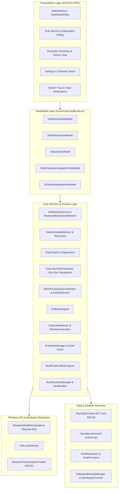
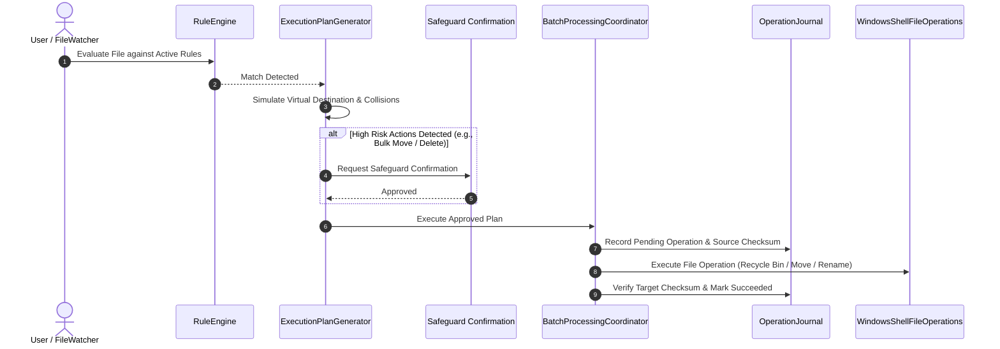

# TidyUp Architecture & Technical Design

## 1. Architectural Overview

TidyUp is a hardened, high-performance automated file organization system for Windows built with **.NET 9.0** and **WPF**. The application is designed around five primary architectural pillars:

1. **Safety-First Invariants:** All file operations are simulated, journaled, reversible, and recycle-bin protected. Accidental permanent data loss is architecturally prevented.
2. **Predictable MVVM Architecture:** Presentation is strictly separated from domain logic using `CommunityToolkit.Mvvm` and `MaterialDesignThemes`.
3. **Hardened File Monitoring:** Multi-threaded, bounded event debouncing with buffer-overflow self-healing and exponential backoff retry queues.
4. **Rich Rule Engine:** Recursive condition trees supporting file names, extensions, sizes, timestamps, streaming content search/regex, and EXIF/media metadata.
5. **Transactional Persistence & Disaster Recovery:** SQLite persistence with automated daily snapshots, startup `PRAGMA integrity_check`, pre-migration backups, and atomic rollback capabilities.

---

## 2. System Architecture Diagram

---

## 3. Core Subsystems

### 3.1. Safety Invariants & Execution Pipeline

All file operations adhere to a strict invariant chain:

- **Recycle Bin Protection (`ISafeFileSystem`):** Permanent file deletion is blocked by default. Files sent for deletion use Windows Shell APIs (`SHFileOperation` / `IFileOperation`) to move files safely to the user's Recycle Bin. Non-supporting volumes (e.g., raw network shares) require explicit user authorization.
- **Dry-Run Simulation (`ExecutionPlanGenerator`):** Rules can be simulated on demand. Potential collision conflicts (e.g., destination file already exists) and circular chaining risks are detected prior to disk modification.
- **Two-Phase Journaling (`OperationJournal`):** Operations are logged with SHA-256 pre-execution checksums, batch IDs, operation types, and timestamps.
- **Atomic Rollback (`RollbackEngine`):** Allows 1-click inverse operations (Move $\rightarrow$ Move back, Copy $\rightarrow$ Delete copy, Rename $\rightarrow$ Revert name). Rollback verifies file integrity before attempting reversals.

---

### 3.2. Hardened File System Monitoring

- **`HardenedFileSystemWatcher`:** Wraps .NET `FileSystemWatcher` with internal buffer configuration (64KB), multi-event debouncing (default 500ms), and error recovery.
- **Buffer Overflow Resilience:** Catches `InternalBufferOverflowException` and triggers an active directory reconciliation crawl to recover any dropped events.
- **`FileLockDetector`:** Polls locked files (e.g., ongoing downloads or large file copies) with progressive exponential backoff and timeout safeguards, ensuring partial writes are never processed prematurely.
- **`WatcherHealthMonitor`:** Tracks folder connectivity. Network disconnections transition the folder state to `Degraded`, automatically reconnecting when available.

---

### 3.3. Rule & Condition Engine

The rule engine processes recursive condition trees:
- **Condition Groups:** Arbitrary depth nesting with `LogicOperator.And` and `LogicOperator.Or`.
- **String Conditions:** Case-insensitive/sensitive matching, prefixes, suffixes, exact equals, and regular expressions.
- **Size & Date Conditions:** Bounded byte ranges and creation/modification ages (e.g., older than $N$ days).
- **Streaming Content Search:** Scans text documents (.txt, .md, .csv, .json) for keywords or regex patterns safely chunked up to 1MB without allocating multi-gigabyte files into RAM.
- **EXIF & Media Extraction:** Extracts image dimensions, camera models, EXIF Date Taken, MP3 ID3 tags, and WAV durations.
- **Conflict & Dependency Analyzer:** Analyzes rule sets for shadowed rules (prior rules consuming matching items) and competing destination paths.

---

### 3.4. Duplicate Detection Engine

Implements a 3-phase duplicate identification algorithm:
1. **Size Partitioning:** Groups files by exact byte size. Singletons are skipped immediately without file I/O.
2. **Partial Hashing:** Reads only the first 4KB of files within identical size buckets. Non-matching headers are discarded.
3. **Full SHA-256 Verification:** Full cryptographic hashing is performed solely on files sharing identical sizes and 4KB partial hashes.
4. **Resolution Options:** Safely move duplicates to an isolated `_Duplicates` directory with automatic collision avoidance, recycle to the Windows Recycle Bin, or skip.

---

### 3.5. Scheduling & Windows Power State Awareness

- **Execution Modes:** `Continuous` (watcher-driven), `Scheduled` (specific time-of-day), or `ManualOnly`.
- **Quiet Hours:** Configurable execution suspension windows (supporting overnight ranges spanning midnight, e.g., 22:00 to 06:00, and weekend toggling).
- **Power State Integration:** Queries Win32 `GetSystemPowerStatus` via P/Invoke. Background processing automatically pauses on low battery ($\le 20\%$) to conserve charge when disconnected from AC power.

---

### 3.6. SQLite Persistence & Disaster Recovery

- **Database Context (`TidyUpDbContext`):** Entity Framework Core with SQLite provider (`tidyup.db` in `%AppData%\TidyUp`).
- **`DbIntegrityChecker`:** Executes SQLite `PRAGMA integrity_check;` on startup. If database corruption is detected, the system safely restores the latest healthy backup.
- **`DatabaseBackupManager`:** Takes daily automated snapshots and pre-migration safety backups before applying schema updates. Includes manual backup exports in Settings.
- **Rule Versioning (`RuleRevisionManager`):** Automatically saves immutable rule snapshots on edit, offering visual side-by-side diffing and one-click restoration.

